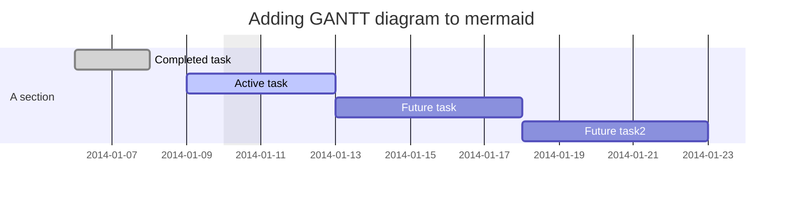

As ChatGPT (and, inevitably, other large language models) explode onto the scene in late 2022, questions around content moderation become more imperative.

In fact, one such thread is the inspiration for this post: [Ask HN: Should HN ban ChatGPT/generated responses?](https://news.ycombinator.com/item?id=33945628)

At first, it seems easy to answer this question. Of course, we don't want bots clogging our human discourse! How can we ever know what is _real or fake_ if we do?

I don't want to discount the importance of the leap in technology these models are providing. But we should work to think clearly about the role AI, and more to the point, technology more generally, plays in our lives.

### The tools and their wielders

Writing is fundamentally entangled in technology from the start. The earliest writing in clay with sharp objects was the start; the sharp object was, in the simplest sense, an assistant to the writer, helping shape the clay in a way that other humans could understand the form and make sense of it.

And writing didn't change drastically (other than adding new symbols that reflected culture) for a long time.

And then, suddenly, the printing press. You know this story, but have you ever considered the printing press similar to AI? Not in the sense that it produces novel output given some input. But from a social standpoint, we went from knowing that a given piece of work was produced directly by its author, to some disconnected copy of a copy, typeset by some person we'd never known before.

How could we guarantee the authenticity? And indeed, this was the fear - particularly amongst religious groups; the printing press could be used to undermine the official religious texts. False prophets could easily print their own versions of the Bible.

And, of course, those same groups had access to the same technology. Now, it was possible to publish critiques broadly.

### It looks like you're trying to write a unique comment on the Internet.

But the point is, we've always had access to some technology. And it's both a scale and a spectrum. The scale shows a depth of involvement: how _much_ does it help? The spectrum shows different kinds of help. In the case of the printing press, that was helping with replication.

But other advances have been made on other parts of that spectrum. A dictionary might be considered one such advancement. No, it doesn't spell words for you - but it *is* technology that helps you spell correctly. Continuing down that same path, spellcheck (the red squiggly) helps with a similar task. But an amazing leap was made when we first saw grammar checks, too. Now, not only does your computer do the lookup in the dictionary for you, but it also assists to make sure the word you are using is the correct one given the grammatical context.

But perhaps the most salient experience most remember with an "AI assistant" is not from some dystopian movie, but in Microsoft Word, when they first met Clippy.

Clippy provided a new kind of assistance; it spied on what you were writing (with no malicious intent of course), and checked for patterns; are you writing an essay? A letter? A resumé?

Clippy could help. On the spectrum, Clippy acted a bit like a formatting secretary, and worked alongside its spell-checking and grammar-checking robot teammates.

### Is it a brain if its Bayesian?

These tools were built on, presumably, basic decision algorithms mixed with an extremely limited domain of knowledge. I say presumably because I didn't do a deep dive on the specifics, but also because it's only been possible to do more complex AI work recently, as processing speed catches up to our workload demand.

A Bayesian model, in all its simplicity, is also incredibly powerful, especially when chained with multiple other Bayesian models. We overestimate the complexity of the majority of rough decisionmaking. Simultaneously we underestimate the exponential growth in complexity when we start talking about more complicated decisions.

A good Bayesian model may feel "smart" - indeed, we call our home devices smart just for remembering and executing on a daily schedule, or other basic rules.

### The assistant becomes the thinker

I'm sure there is some record somewhere of teachers being afraid that our collective knowledge of how to spell would just degrade as a result of spellcheckers. In the same way that cursive died when typewriters became accessible.

But those assistants were taking responsibility for things we consider non-essential. That is, the spelling of the word doesn't change the _meaning_ of the word.

The shift in thinking now is that we have tools that blur the line between assistance and impersonation.

On the spectrum, something like ChatGPT stands out against the rest of the tools, in that it simulates something uniquely new.

With previous assistant tools, the intent was to provide some help on the "outside" - that is, to help the person formulate the words correctly. To spell them right, to replicate them, to make sure they've chosen the right words in context... But, in all of these cases, the fundamental composition of _thought_ was still done inside the person's own mind.

The large language model _seems_ to change this dynamic, such that the "machine" does the novel thinking.

But we know that the NLP algorithm is actually trained on - and this is the amazing part - the writing that all of those other assistants helped make possible up to this point. The LLM knows nothing other than what we've told it.

Early printers told printing presses what order to put the letters. Microsoft told Clippy what a resumé looks like. And we all, collectively, told ChatGPT what order words tend to come in.

And so now, you "ask a question" and ChatGPT "answers" - in fact, that's not what is happening behind the scenes. ChatGPT looks at words and predicts the next most likely word.

### Not so special

This is not all _that_ different, in the universal sense, than what Clippy did. We provide some input, it provides some output based on processing our input against some rules it has. It just so happens that we're _very bad_ at detecting the difference between language coming from a prediction algorithm vs language coming from a person. (To be fair, I should give significant credit here to just how good ChatGPT does with this prediction.)

So it seems one or both of the following must be true:

- We overestimate how unpredictable our language is (especially given enough samples)
- We underestimate the comprehensive capacity of neural networks to approximate the process of speaking/writing like a human

I believe both are true. The ruleset Clippy had, though, was more "robotic." Interestingly, the same concerns aren't raised about other predictive algorithms with similar levels of accuracy.

Self driving cars, search engines, or price prediction algorithms are all sophisticated to similar degrees as ChatGPT. The _scale_ is similar, but the _spectrum_ is different. The jobs performed by driving cars only feel vaguely human. The job performed by a price prediction algorithm doesn't feel human at all - it represents a fundamentally new capability. There is little sense of concern attached as a result.

### An illusion

If you see a comment that is valuable on a hacker news thread, to what level does it matter that the comment was generated? There is both the intrinsic and extrinsic value to consider: intrinsically, something might feel wrong to some people about allowing generative text algorithms to participate in an otherwise human discussion.

Or perhaps more directly, allowing generative text algorithms to _trick us into thinking they are human._

The extrinsic part deals with the system created around these conversations. If ChatGPT begins to earn karma, what does that mean about the value of karma on HN?

If part of the value of HN is that it is curated by humans, the karma gathering by bots also means the ordering of the top posts would be influenced by those same bots. Extrapolating, if someone were to train a bot on the karma system, we could feasibly expect that the bots would be able to "take over" HN by posting based on a language model that is specifically optimized for karma.

This wouldn't be an autonomous process - ChatGPT, or any other hyper-optimized bot - has no "intent" other than what we give it. I am an AI optimist.

### The problem with AI assistance is actually just humans.

But I am not an optimist when it comes to human moderation. The challenge we have in front of us is not a fight against AI.

Instead, these powerful assistants will likely result in faster optimization of messaging echo chambers. People, right now, are looking for ways to use this tech to quickly create monetization pathways for your attention.

But! Much like the days of the printing press, we have the same tools. We can use them for good rather than for nefarious at-all-costs profit-seeking.
