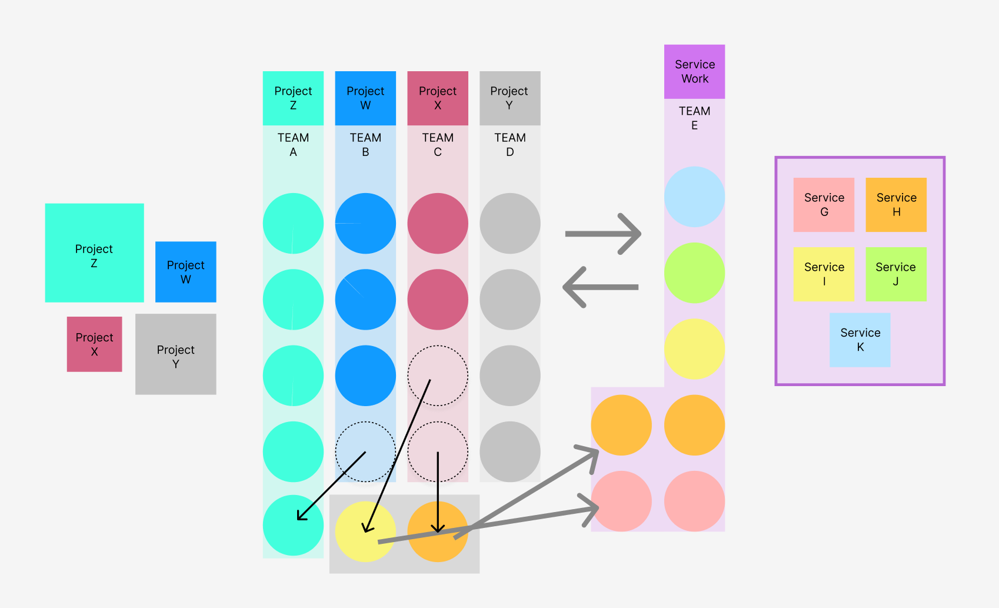
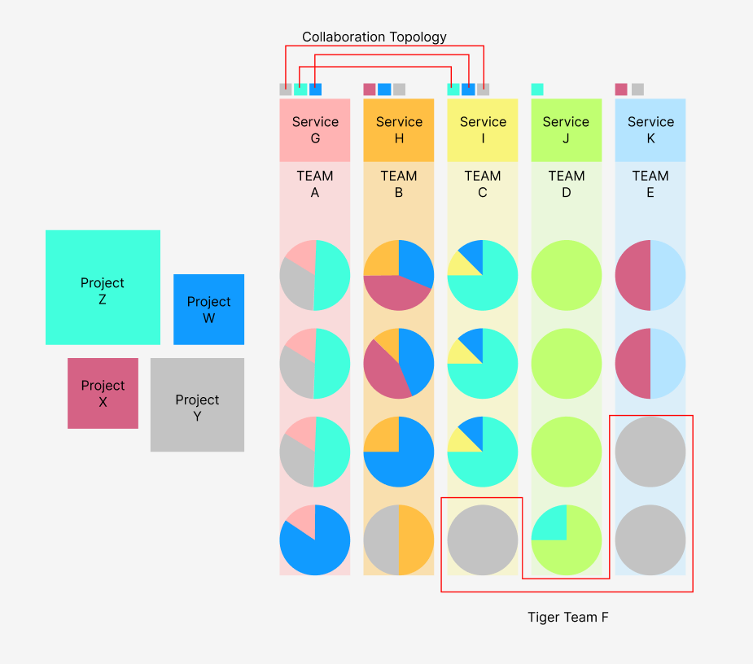
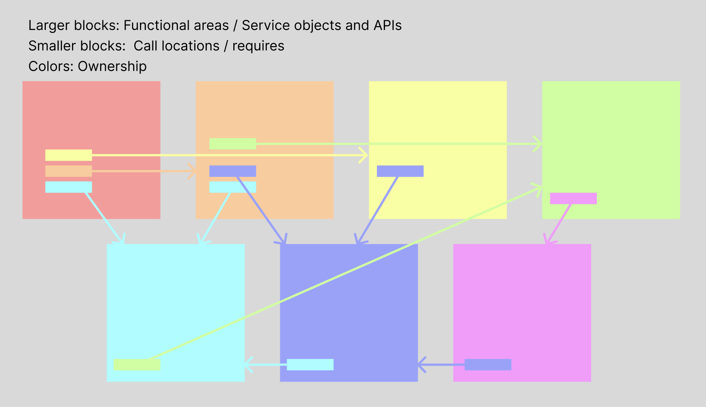
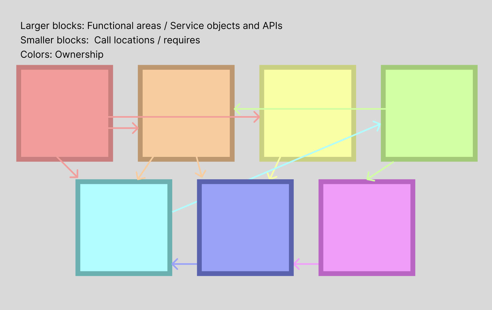

As organizations heads into a future where cross-cutting projects are the norm, they face an intuitive question: should we align our teams around projects, or is there a better way?

The answer isn’t clear cut, but let’s dig in to the pros and cons, and how each of these models would look.

First, we’ll explore how project and domain team paradigms would work.

## Project Teams

Teams will be assembled to tackle projects for their duration. When projects are large, multiple teams may be assembled; those teams may be assembled based partially on rough domain / service boundaries, or based on tech stack horizontal (backend, frontend, etc).

As the diagram illustrates, teams will be dynamic and reallocated based on project demand. No formal team structure would map to service work; service work would be slotted in on an as-needed basis.

There are two possible reporting structures in this world.

**Project Team Structure, Option 1: Dotted line reporting (QB + people-manager)**

Engineers would have a dotted line reporting structure. Their primary people manager would manage individuals across multiple projects. Engineering managers may also be responsible for “QB”-ing an initiative, assembling the teams around a project and organizing the resources and timeline, etc. This QB role may instead be held by director-level managers. However, engineering managers may not be as involved in technical planning in this paradigm, as their reports are spread across many projects.

EMs might be aligned to one or more services, and engineers would still operate as codeowners over services or areas of code. The EMs would be in the know about their individual engineers’s projects, but are not necessarily leading those projects. A given EM may be a QB for a project where only one or two of their reports are working on that project. It is unlikely that an EM is a QB for a project where none of their reports are actively involved.

Performance management in this world can be a challenge; a given engineer’s people-manager EM would request feedback from the QB and other collaborators for that engineer’s work over some period of time, but direct observation would be a less common opportunity in this paradigm.

**Project Team Structure, Option 2: Agency Teams**

In this structure, teams will remain with the same manager, and the whole unit moves between projects. This is largely reflective of an “agency” model. Managers would not be tied to any domain or service necessarily, but teams would work quarter over quarter together on a variety of projects.

The concept of codeowners gets stretched in this paradigm, as a given codeowner may not be touching their “homebase” code for a long period of time. Thus this paradigm does not optimize for code ownership.

If there are multiple teams working on the same project, their may still be a project QB under this format.

Generally, teams would work in areas they are familiar with, but this is not a strict rule as much as it is a heuristic in this structure. Teams may be organized into multi-functional units (i.e. crossing skill boundaries), or could be grouped by skill (i.e. “backend team”).

**Service work and KTLO in a project-oriented environment**

Service work would be done as a secondary priority in this format. Because teams are assembled around projects, the incentive to focus on project work is implicitly higher than the priority of ongoing service work. Additionally, the resources available for a given service would be dependent on the project load share on the service’s codeowners. There is one exception to this rule: when a given project is entirely within the context of a single service (or close), the team, project, manager, and service all remain aligned.

## Domain Oriented Teams

In contrast to project teams, which are fully (or almost fully) focused on a single project crossing multiple services, a domain team would be responsible for projects as they impact a given domain.

Not all projects cross domain boundaries; it is also very rare that a project will cross _all_ domains at any company of reasonable size.

In this paradigm, engineers allocate a percentage of their time to different types of work. The organization lays out the projects and the relative priority between them, and teams work to determine what execution ordering and structure would make sense based on dependencies, priority, and resource constraints.

As a general rule, assuming all things being equal, highest priority projects receive first attention. However, in reality, prioritization is not always as simple as “this project is top priority.” Some examples of how it gets complicated:

- Some work, though not necessarily urgent, is a blocker for other work that will _become_ urgent.
    
- Some work is unpredictable in its smallest form (though reasonably predictable as a collective whole) and critical for the company to survive (KTLO)
    
- A given set of work may be difficult or impossible to parallelize, thus two teams may simultaneously be working on things of different priority levels
    

Domain oriented teams are organized in an effort to retain some level of domain expertise across the critical areas of the company. However, sometimes in a domain oriented team, the cross-team coordination required to finish a given initiative quickly can be a challenge. This is when Tiger Teams might be useful.

Tiger teams provide an avenue to assemble a temporary project-oriented team to accomplish a given set of work. This temporary team looks very much like the previous paradigm - a project QB is leading the team through dotted lines, and each member has a people manager that they report to directly.

Tiger Teams should only be assembled for a clear and discrete scope of work, and should not become the “norm” in this paradigm, as this transfers the burden of the KTLO work onto fewer members of the team in addition to other ongoing cross-coordinated project work. If every project is “critical” enough to assemble tiger teams, then it would be better to align to a project-oriented paradigm all together.

As depicted in the diagram, there are also overlaps of collaboration topology that should be made clear when two or more teams are working on the same project.

When two teams are planned to work on a project, it is useful to describe how those teams will interact during that project’s lifecycle. Is one providing a service to another? Are they collaborating on building a common codebase? Is one team facilitating another through mentorship or other kinds of help (knowledge transfer, for example)?

# What considerations should we make when picking between these paradigms?

Generally speaking, look at your intentions for the long run. If you are moving toward a service oriented architecture, the implications are very different than if you want to run a mono-repo or even a monolith.

Perhaps you are preparing for an exit - in this case, your focus likely will be on certain projects rather than creating long-lasting domain knowledge and org design.

Maybe your product is pivoting quickly, and you are building many POCs. This is another situation where a project orientation makes more sense.

Overall, the prevailing consideration is to understand what you are *investing* in. With a domain orientation, you are investing not only in the current ongoing new priorities, but in maintaining the existing surfaces and complexity you've developed in the past.

If you're in early startup territory, you may not even *know* what your domains *are.* That doesn't mean you can't start doing some kind of domain modeling, but at that stage your org design is probably limited more by resources and lack of scale than anything else; project orientations actually serve to extend domain knowledge out of individual silos in this case.

In *most* cases, however, the paradigm of domain oriented organizational design is a reasonable default.

Finally, it's reasonable to consider the ownership model your organization currently has. In most organizations, domains emerge either within a singular (or many similar) contexts that combine multiple domain concerns into a single codebase. Ownership is mostly dependent on the conceptual domain, but is not clearly delineated in the actual code.

In a service architecture that aligns ownership with services, the calls tend to look more separated, and the caller owns the call locations themselves.

In this case, the caller would be responsible for whatever integrations they have with other services. This model fits generally better with domain oriented teams than with project teams.
# What type of team approach makes the most sense in a service-oriented architecture?

> Organizations which design systems (in the broad sense used here) are constrained to produce designs which are copies of the communication structures of these organizations.
> 
> —  Melvin E. Conway, How Do Committees Invent?

As a broad-strokes assertion, most service-oriented architectures lend well to domain-oriented teams, in part because of Conway’s law. If the organization of people matches the system they tend to create, our organizational structure matching our SOA is a reasonable starting place.

And, this may also help us describe why project orientation is tempting in the first place; with our current monolithic structure, it’s a reasonable expectation that you might touch _any_ part of the codebase, so why would we draw boundaries that don’t exist in our system? (This might be a sort of a reverse version of Conway’s law, that we might design our communication structures in a way that fits the system.) And if we had plans to double down on keeping the monolith, this recommendation would be a fairly clear frontrunner.

Let’s explore the pro’s and cons of each approach in the context of service oriented architecture.

## Project Oriented Teams: Pros + Cons

|**Pros**|**Cons**|
|---|---|
|Efficiency of focus|KTLO becomes far less structured without supplemental organizational planning|
|Staffing based on skillset becomes only a matter of prioritization|Domain expertise may falter as projects jump across domains|
|Consultant capacity is easier to scale-in / out in project oriented work|“Projects” become products; teams that work on a project may disband (depending on squad cohesion strategy). The product then does not have clear ownership, and the distributed ownership problems of the monolith are perpetuated|
|Encourages individual responsibility|Codeowner strategy becomes thin; easy for code to accidentally go unowned or abandoned, hidden risks when the only codeowners of a given area depart the company|
|Provides variety to engineers who may tire of working on the same domain service for an extended period of time|Can result in many different paradigms / technical approaches that compete with each other. This can be messy and inconsistent, creating a “stack of projects” rather than a coordinated set of services, resulting in more information silos|
||Ownership set at project boundaries would passively encourage the whole tech stack to be homogenous.|

## Service Oriented Teams: Pros + Cons

| **Pros**                                                                                                                                                                                                                                                                                                                                         | **Cons**                                                                                                                                            |
| ------------------------------------------------------------------------------------------------------------------------------------------------------------------------------------------------------------------------------------------------------------------------------------------------------------------------------------------------ | --------------------------------------------------------------------------------------------------------------------------------------------------- |
| Long term stability of domain services                                                                                                                                                                                                                                                                                                           | Split focus situations when projects don’t perfectly line up with a full team’s capacity                                                            |
| Identification of outlier concerns with new implementations; as projects are executed, teams ask “how should we integrate this new concern with our domain”                                                                                                                                                                                      | Success for the team may be hard to define, as the business cares less about individual team deliveries and more about project deliveries           |
| More traditional approach to enable SOA. Services can differ from each other, and this differentiation may align with squad skillsets. For example, a given service may be written in a completely different tech stack than another. Having squad ownership lines drawn at service boundaries rather than project boundaries allows for this.   | Onboarding into a domain takes longer than onboarding on to a project, as the history of decisions for the service lay across many past “projects.” |
| Business effort should be allocated based on business interest; domain oriented teams allow organizations to directly invest in ongoing work on areas of the business that are useful, and reduce in areas that are not. This is a forcing function to reduce complexity in unimportant domains / cost centers, and invest in important domains. | Domains are not always “team-sized” - thus a given domain may require multiple teams in tandem to cover the breadth of the problem.                 |

# So what should we do?

No matter which direction your organization goes, the answer to this question is complex and opinionated, and might not be as clear cut as this document proposes. However, based on the assertion that our organization will move towards a service-oriented model, and we want to create a sustainable architecture and teams that can support that architecture in the long run, **this document proposes a domain-based model of ownership and planning with a percentage allocation to tiger teams.** The percentage should be something decided on an ongoing basis, with an ideal maximum threshold set around 15% of resources dedicated to tiger teams. That would translate to 3 engineers per four squads, based on 5-person squad size. Anything greater than this begins to erode the sustainability and predictability of team structures.